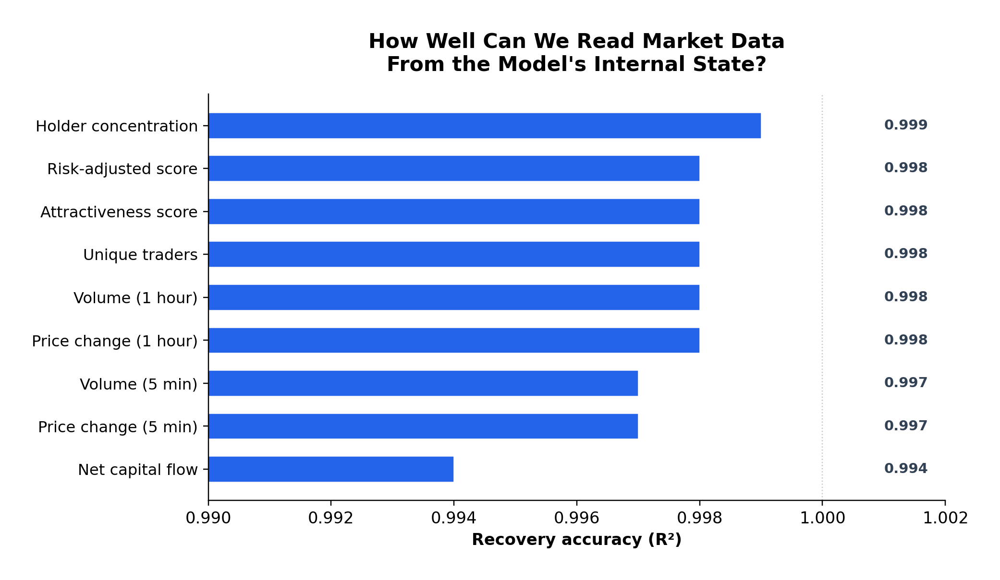
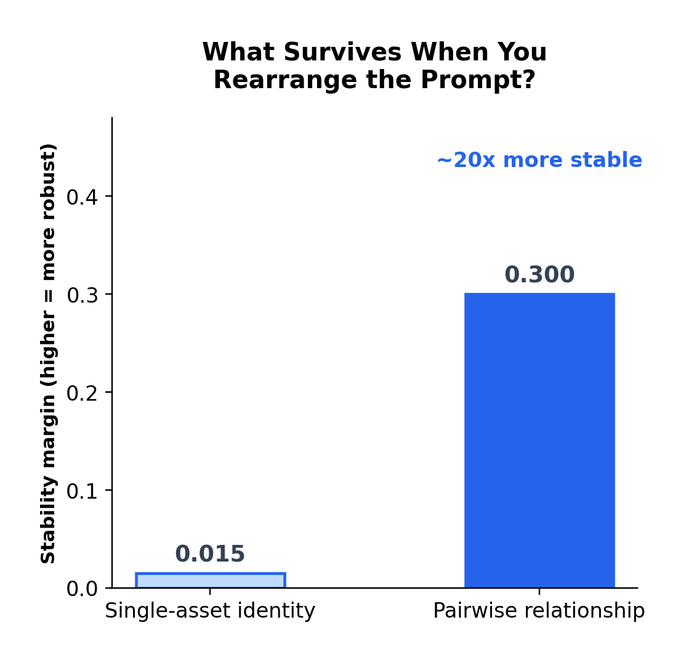
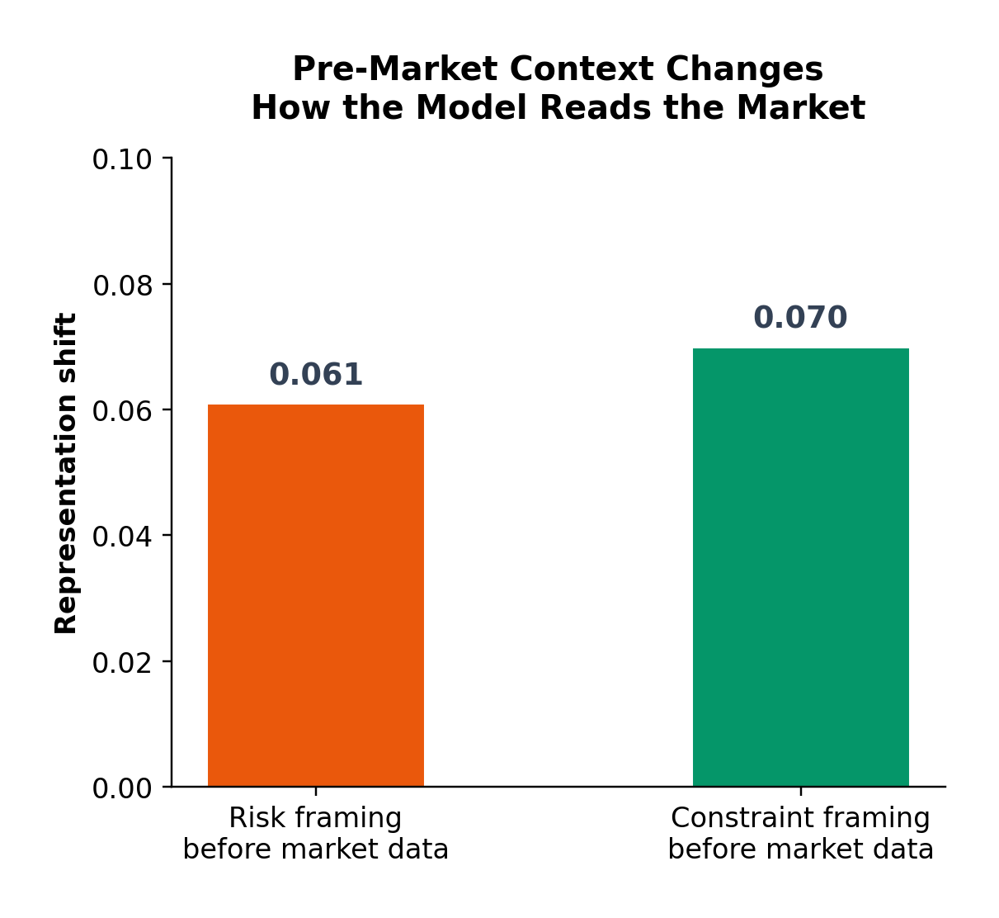
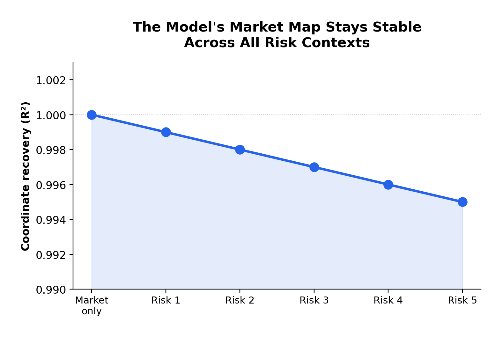
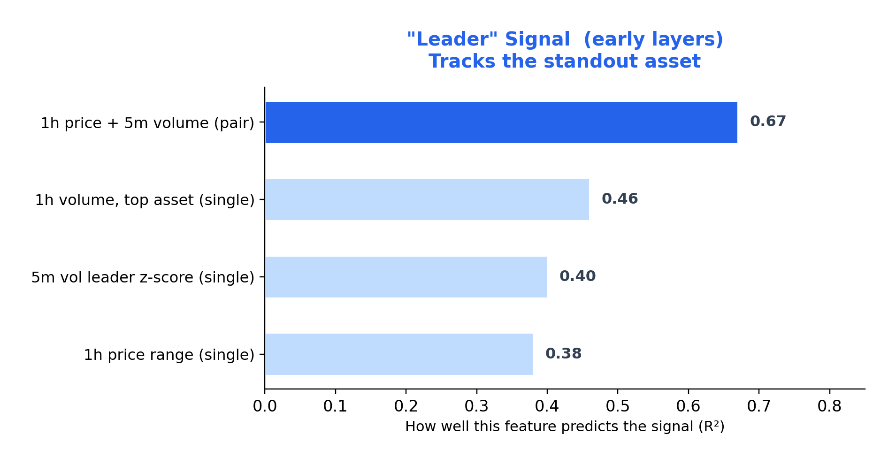
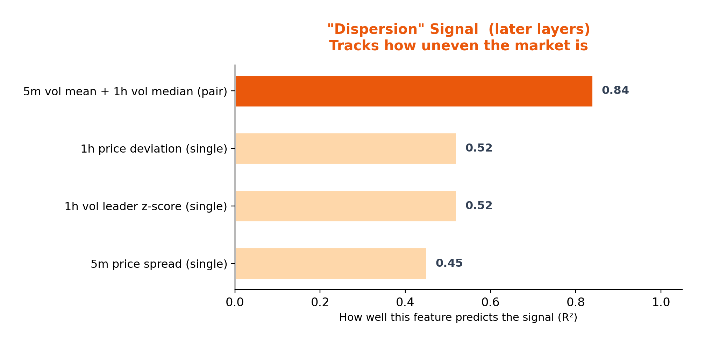
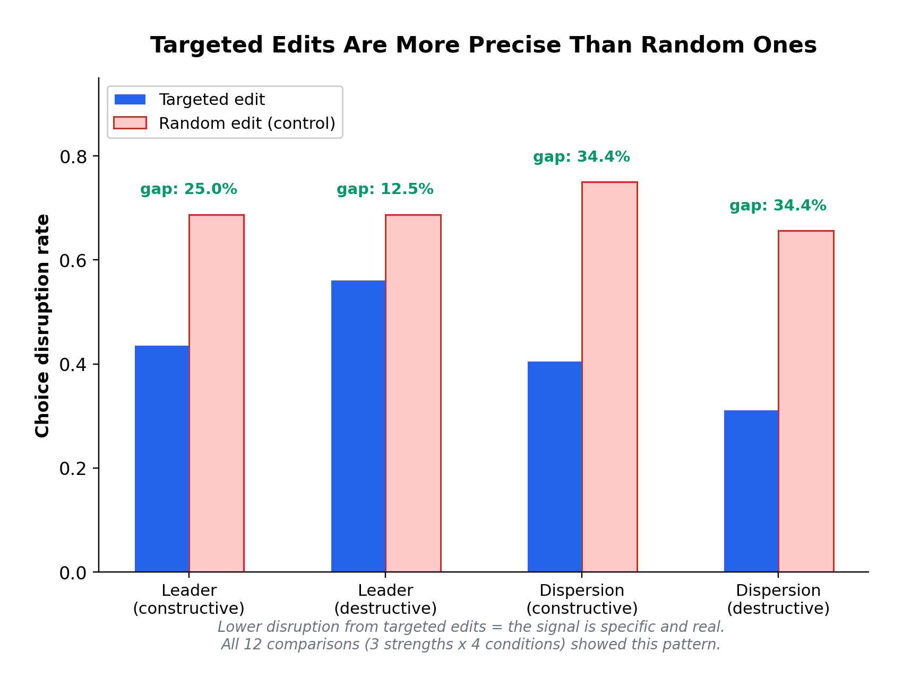
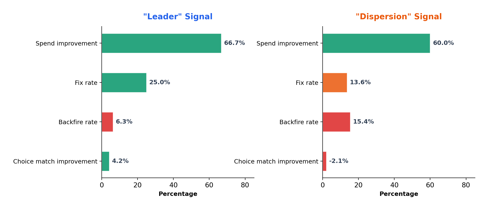
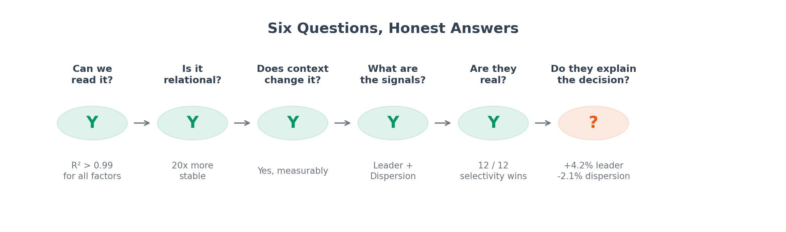

# Opening the Black Box on an AI Trading Agent

**Prepared by:** Concordance
**Date:** April 2026

---

## Background

We operate an autonomous AI trading agent in a live onchain market tournament. The model, a 30-billion-parameter language model (Qwen3-30B-A3B), makes buy, sell, and observe decisions on cryptocurrency tokens. Each decision prompt contains a structured market snapshot for six to ten tokens, the user's risk preferences, portfolio state, and operational constraints.

We conducted a systematic interpretability study to understand what the model internally represents when it processes market data, and whether those representations causally influence the model's final trading decisions.

This post covers our methodology, findings, and their limits.

---

## 1. Market Data Preservation

We tested whether the model's internal state retains the raw market data it reads. Using linear probes on early-layer representations, we measured recovery accuracy for nine categories of market data.

*Figure 1: Recovery accuracy (R²) for individual market metrics from the model's internal state. All factors exceed 0.994.*

Every factor we tested was recoverable with near-perfect accuracy: price changes at 5-minute and 1-hour intervals, trading volume at both timescales, net capital flow, unique trader counts, holder concentration, and composite scores. The model preserves granular market data faithfully. Its downstream decisions are grounded in the actual numbers it was given.

---

## 2. Relational Representation

We tested whether the model tracks assets individually or builds a comparative understanding of the full roster. We shuffled prompts in controlled ways (rearranging row orders, swapping ticker symbols, changing formatting styles) and measured how much the internal representation moved.

*Figure 2: Stability of single-asset identity versus pairwise relationship representations under prompt formatting changes.*

Pairwise relationships between assets were approximately 20 times more robust than single-asset identity under layout changes. This was confirmed across 384 controlled prompt variations spanning four scenario families, multiple formatting styles, different roster compositions, and three magnitude scales.

The model's internal representation is fundamentally comparative. It encodes how assets relate to each other, not where they appear in the prompt.

---

## 3. Context Effects

We tested whether pre-market context (risk preferences, operational constraints) changes how the model interprets market data. We showed the model identical market snapshots with different contextual framing and measured the shift in internal market representations.

*Figure 3: Representation shift when risk framing or constraint framing is presented before the market data.*

Both risk framing and constraint framing produced measurable shifts. We validated this across a full five-level risk ladder (conservative to aggressive). At every level, the base market coordinate system remained almost perfectly intact (R² > 0.995), but the model's interpretation of what the market data meant shifted in structured, level-appropriate ways.

*Figure 4: The model's internal market coordinate system across all five risk levels. The base representation remains stable while interpretation shifts.*

---

## 4. Two Primary Market Signals

We applied statistical decomposition to the model's market-section activations across 184 diverse market scenarios, after controlling for prompt-formatting artifacts (sequence length, character count, number of assets). Two dominant signals emerged.

### Signal A: "Leader" (early processing layers)

Tracks the standout asset: the token that dominates by volume and price momentum.

*Figure 5: Features predicting the leader signal.*

| Predictor | Accuracy (R²) |
|---|---|
| Top asset's 1-hour volume (single) | 0.46 |
| 1-hour price change + 5-minute volume (pair) | 0.67 |

### Signal B: "Dispersion" (later processing layers)

Tracks how uneven the market is: whether one asset stands far ahead or the field is tightly bunched.

*Figure 6: Features predicting the dispersion signal.*

| Predictor | Accuracy (R²) |
|---|---|
| 1-hour price deviation across assets (single) | 0.52 |
| 5-minute volume mean + 1-hour volume median (pair) | 0.84 |

Both signals survived shuffled-data controls (R² collapsed below 0.06), confirming they reflect genuine market content.

---

## 5. Selectivity Testing

To verify these signals play a functional role, we ran intervention experiments. We edited the model's internal state at the location of each signal and compared behavioral consequences against matched random edits of the same magnitude.

*Figure 7: Behavioral disruption from targeted signal edits versus matched random edits.*

| Condition | Targeted Edit | Random Edit | Gap |
|---|---|---|---|
| Leader, constructive | 43.8% disruption | 68.8% disruption | 25.0 pp |
| Leader, destructive | 56.3% | 68.8% | 12.5 pp |
| Dispersion, constructive | 40.6% | 75.0% | 34.4 pp |
| Dispersion, destructive | 31.3% | 65.6% | 34.4 pp |

*Shown at strength 1.0. All 12 comparisons across three strength levels showed the same pattern.*

Targeted edits produced less collateral disruption in every condition tested. Both signals carry specific, non-redundant information.

---

## 6. Causal Contribution to Decisions

We transplanted each signal from one market scenario into another and measured whether the model shifted its decision toward the donor's choice. 48 paired scenarios per signal.

*Figure 8: Results of signal transplant experiments.*

**Leader signal:**
- Choice agreement improved by **+4.2 percentage points**
- Fix rate (correcting wrong choices): **25%** of fixable cases
- Backfire rate (breaking correct choices): **6.3%**
- Spending pattern improvement: **66.7%** of cases

**Dispersion signal:**
- Choice agreement decreased by **-2.1 percentage points**
- Fix rate: **13.6%**
- Backfire rate: **15.4%** (exceeds fix rate)
- Spending pattern improvement: **60.0%** of cases

The leader signal has a genuine, partial causal influence on the final decision. The dispersion signal does not have sufficient causal weight to steer decisions on its own. The complete decision pathway involves additional factors that we have not yet isolated.

---

## What Was Not Supported

**Full decision explanation from market signals alone.**
The transplant experiments show these signals contribute to but do not determine the final decision. The model's decision process involves additional stages that integrate market perception with user-specific factors.

---

## Summary

| Question | Answer | Confidence |
|---|---|---|
| Does the model build a real internal picture of the market? | Yes. Every tested factor recoverable with R² > 0.99. | Strong |
| Is the representation relational? | Yes. Pairwise comparisons ~20x more stable than single-asset tracking. | Strong |
| Does pre-market context change the market read? | Yes. Risk and constraint framing both produce measurable shifts. | Strong |
| Can we identify specific internal signals? | Yes. A "leader" signal (standout asset) and a "dispersion" signal (market unevenness). | Strong |
| Are these signals real? | Yes. Selectivity tests pass in 12/12 comparisons. | Strong |
| Do these signals fully explain the final decision? | No. Partial contribution from leader. No net contribution from dispersion. | Honest |

The model builds a precise, structured understanding of the market. It preserves raw data, constructs relational comparisons, and maintains a stable internal coordinate system that context can shift but does not replace. The two signals we isolated are real features of the model's reasoning. They are confirmed as meaningful by selectivity testing. They do not, on their own, account for the full decision. Identifying the remaining factors is the next phase of research.

---

*Research conducted by Concordance on Qwen3-30B-A3B. Activation capture and interventions executed on Modal (A100-80GB GPUs). Validated with matched random controls and bootstrap confidence intervals (2,000 samples). Datasets: 184-920 synthetic market scenarios per experiment; 203,292 real inference logs as reference; 11,579 real activation captures for bridge validation.*
