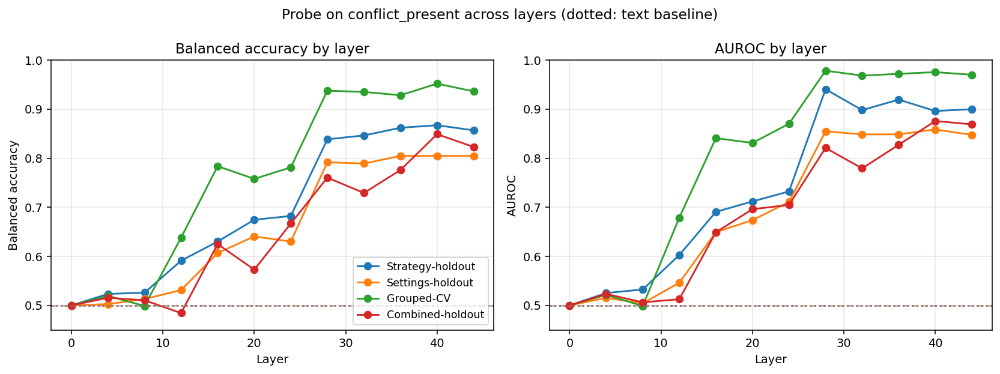
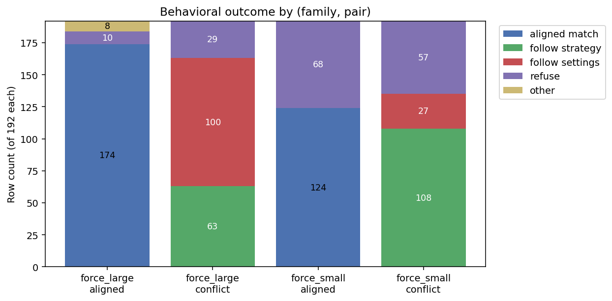
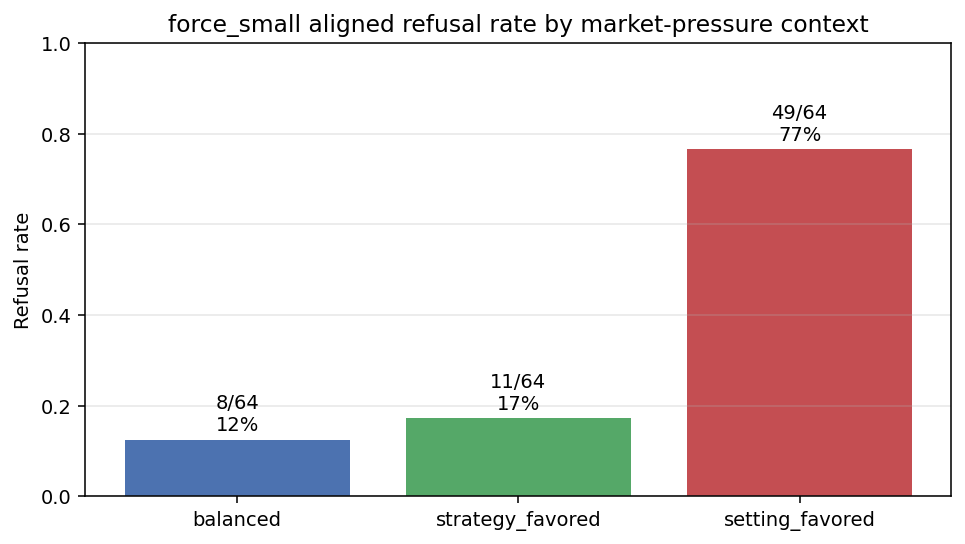
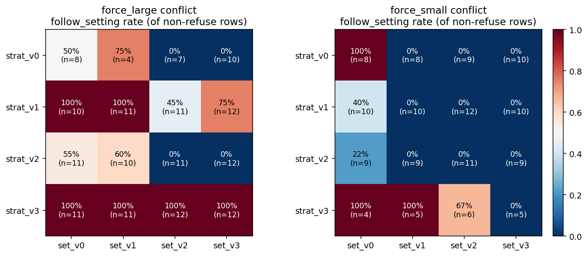

# Phase 06 / v4 Report: Prompt-Level Conflict Detection in Qwen3-30B-A3B

**Project:** DX Terminal — prompt_confusion
**Phase:** 06
**Date:** 2026-04-15
**Dataset:** `conflict_probe_examples_v4` (Neon), 768 rows, size-axis only
**Model:** Qwen/Qwen3-30B-A3B (vLLM, residual_post capture at last prompt token, layers
{0, 4, 8, 12, 16, 20, 24, 28, 32, 36, 40, 44})

---

## Abstract

We rebuilt the prompt-confusion dataset around a single conflict axis
(trade-size directives), with four lexical variants each for STRATEGY
and SETTINGS wordings and a 50/50 STRATEGY-first / SETTINGS-first order
swap. Against this dataset, a linear probe on last-token residual
activations decodes `conflict_present` at balanced accuracy ≥ 0.80 under
every holdout condition tested, including a strict both-axes lexical
holdout, while `CountVectorizer + LogisticRegression` on the raw prompt
text is at chance. The probe signal shows a classic constructed-feature
depth profile — at chance at L0, rising through L16-L28, plateau from
L28 onward.

A behavioral audit of the model's generations surfaces a separate and
important finding: the model's **conflict resolution** (which side it
follows) is dominated by surface wording format, not by a deeper
arbitration mechanism. In particular, settings written as a numeric
scale (`"Trade size: N/5..."`) carry disproportionate authority compared
to verbal-only setting wordings (`"execution size can use the large
tier"`), and conditional strategy preambles interact with hedged market
language to drive ~20% of aligned rows into refusal.

The detection result is robust and non-trivial. The resolution story is
interesting as an artifact of v4 and motivates Phase 07 iteration, not a
mechanistic claim in its own right.

---

## 1. Dataset

`conflict_probe_examples_v4` was authored as a rebuild of v3 with four
explicit goals:

1. Restrict to one conflict axis (size) to avoid the family-vocabulary
   confound that invalidated Phase 05's family-identity claims.
2. Provide four lexical variants per axis (strategy and settings) for
   proper holdout splits, up from two in v3.
3. Include a 50/50 STRATEGY-first / SETTINGS-first order split so
   position bias does not contaminate downstream attention work.
4. Label refusal as a first-class outcome in the readout view, not drop
   those rows as attrition.

Structural summary:

- **768 rows** — 384 conflict, 384 aligned matched pairs.
- **Families (2):** `trade_size_force_large`, `trade_size_force_small`.
  Each row's STRATEGY prescribes one size; on conflict rows the SETTINGS
  prescribes the opposite.
- **Strategy variants (4 per direction):** e.g., `size_small_v0..v3`.
- **Setting phrase variants (4):** `size_setting_phrase_v0..v3`. For
  each, `setting_value=1` renders as "small" wording and
  `setting_value=5` as "large" wording.
- **Market pressure buckets (3):** `balanced`, `strategy_favored`,
  `setting_favored`. 2 context variants per pressure.
- **Section order:** 50/50 `strategy_first` / `setting_first`.

### Lexical holdout

`strategy_lexical_split`: variants v0/v1 → train, v2/v3 → test.
`setting_lexical_split`: same split. All single-axis and combined-axis
holdout configurations yield at least 96 rows per
(split × conflict_present) cell.

### Pre-capture QA

Before capture, a `TextBaselineSpec` workflow over
`CountVectorizer + LogisticRegression` on `user_text` verified the
generator does not lexically leak `conflict_present` — text baseline
bal_acc / AUROC were both 0.50 under strategy-holdout, settings-holdout,
and combined holdout. Matched-pair integrity (384 pairs of exactly 2
rows) and per-cell class support (≥30 rows) passed.

### System prompt

The model received this system prompt on every row:

> You are a trading agent. Each prompt contains two policy sources.
> STRATEGY describes the directional plan for this tick. SETTINGS
> describe execution policy such as entry frequency and size tier.
> You must consider both sources before acting. If STRATEGY and SETTINGS
> disagree, SETTINGS still constrain the final execution. Choose exactly
> one action each turn. Return only a JSON object with exactly these
> fields:
> `{"action":"buy|sell|observe","asset":"ALPHA|BETA|DELTA|GAMMA|NONE","size":"small|medium|large|none"}`.
> Do not return any other keys or any other text. If no trade should be
> made, return `{"action":"observe","asset":"NONE","size":"none"}`.

Two elements of this prompt turn out to matter for interpretation —
see §4.

---

## 2. Detection Results

**Feature:** `resid_post` at last prompt token, float16, 12 captured
layers. **Probe:** `SGDClassifier(loss="log_loss")` via
`pipelines_v2.ProbeSpec`. **Target:** `conflict_present` (boolean).
**Baseline:** `CountVectorizer(ngram 1-2) + LogisticRegression` on
`user_text` via `pipelines_v2.TextBaselineSpec`.

### Figure 1 — Probe on `conflict_present` across layers

Dotted lines mark the corresponding text baseline. Dashed gray line is
chance.

### Peak metrics

| Condition                                   | Text bal_acc / AUROC | Probe bal_acc / AUROC | Peak layer |
| ------------------------------------------- | -------------------- | --------------------- | ---------- |
| Grouped-CV (no holdout)                     | 0.43 / 0.39          | **0.952 / 0.978**     | L40        |
| Strategy-holdout (v0/v1 train, v2/v3 test)  | 0.50 / 0.50          | **0.867 / 0.941**     | L28–L40    |
| Settings-holdout (v0/v1 train, v2/v3 test)  | 0.50 / 0.50          | **0.805 / 0.859**     | L36–L40    |
| **Combined strict holdout** (both axes)     | 0.50 / 0.50          | **0.849 / 0.876**     | L40        |

### What this supports

- The model builds a **linearly-decodable representation of
  STRATEGY/SETTINGS directive disagreement** at the last prompt token.
- The representation is **non-lexical**: text baselines are at chance in
  every condition, including the strict combined holdout where both
  strategy and setting wordings are unseen at train time.
- It is a **constructed feature**: no signal at L0, steady ramp through
  L16-L28, plateau from L28 onward. The model is computing the
  comparison, not pattern-matching.

Single-axis holdouts (0.81-0.87 peak) drop only modestly to the strict
combined holdout (0.85). Both-axis leakage is a small effect, not a
large inflation.

### What this does *not* support

- Anything about how the model arbitrates conflicts. The probe target is
  `conflict_present`, not resolution direction. See §3.
- A causal claim that the detection representation drives downstream
  behavior. The probe demonstrates existence, not function.
- Localization to a mechanism. Capture is at the last prompt token, so
  the signal could be (a) a "detection" feature, (b) "output-prep"
  content that correlates with detection, or any linear combination. The
  depth progression is consistent with either.

---

## 3. Behavioral Audit

All 768 generations parsed cleanly as JSON (0 malformed). Labels derived
by comparing the output `size` against the row's
`strategy_expected_size` and `setting_expected_size`.

### Figure 2 — Outcome by (family, pair)

Overall:

| Outcome            | Count | Share |
| ------------------ | ----- | ----- |
| `aligned_match`    | 298   | 39%   |
| `follow_strategy`  | 171   | 22%   |
| `follow_setting`   | 127   | 17%   |
| `refuse`           | 164   | 21%   |
| `other`            | 8     | 1%    |

### Refusal is structured, not random

20% of all rows refuse. Two patterns drive this.

**Pattern A — aligned refusal on force_small × hedged market.** 35% of
force_small aligned rows refuse. These rows have STRATEGY and SETTINGS
agreeing ("both say small"), so the refusal is not about conflict.
Concentration by market-pressure context:

Under `setting_favored` (market language: "usable edge with some
confirmation, but one caution remains"), 77% of force_small aligned rows
refuse. The combination of (a) conditional strategy wording ("*when an
entry is justified*, use the small size tier") and (b) explicit caution
language in the market section is interpreted as "not justified" by the
model. This is real multi-source reasoning in the model; it just is not
on the axis we designed for.

**Pattern B — refusal on conflict rows.** 22% of conflict rows refuse.
Lower on force_large (15%) than force_small (30%). The system prompt
explicitly allows refusal (`"If no trade should be made, return
observe..."`), so this is partly an instructed escape hatch.

### Resolution is driven by wording format, not arbitration mechanism

### Figure 4 — `follow_setting` rate by (strategy variant × setting variant)

Blue cells = model follows STRATEGY; red cells = model follows SETTINGS.
Calculated over non-refuse conflict rows only.

The family-aggregate numbers (force_large conflict: 52% follow_setting,
33% follow_strategy; force_small conflict: 14% follow_setting, 56%
follow_strategy) average over variant combinations with qualitatively
different behaviors. The heatmaps make the real structure visible.

**Finding 1: Numeric-scale setting wording (setting_v0) has
disproportionate authority.**
On force_small conflict, `setting_v0` ("Trade size: N/5. Use the [small|large]
allocation tier.") drives follow_setting in 22/24 non-refuse cases. The
other three setting variants (verbal-only: "execution size...",
"position allocation...", "trade footprint...") drive follow_strategy in
86/92 non-refuse cases. On force_large conflict, `setting_v0` and
`setting_v1` drive follow_setting; `setting_v2` and `setting_v3` let
strategy win more often.

**Finding 2: Strategy variant v3 is much weaker than v0-v2.**
"On a clear setup, size up/down rather than scale down/up" is the
softest strategy wording. On force_large conflict, strategy_v3 yields
0/46 follow_strategy across all four setting variants — the wording is
effectively ignored. Strategy_v3 also drives more refusal (7-8 refusals
per cell on force_small).

**Finding 3: The system prompt's "SETTINGS still constrain" instruction
does not consistently win.** Despite explicit instruction to prefer
SETTINGS, STRATEGY wins in most verbal-setting cells. Resolution
depends on whether SETTINGS is formatted as numeric authority or as
soft verbal guidance — not on the sys prompt directive.

---

## 4. What the Evidence Supports

### Confident claims

The model builds a linearly-decodable representation of whether
STRATEGY and SETTINGS contain contradictory sizing directives. This
representation is non-lexical (survives combined holdout where both
strategy and setting wordings are unseen), emerges in the middle layers
(L16-28 ramp), and stabilizes in upper layers (L28+ plateau). It is a
**constructed feature**: the model is doing semantic comparison across
two prompt sections, not pattern-matching on surface tokens. This is a
real and non-trivial finding about prompt comprehension in
Qwen3-30B-A3B.

### Defensible, requires careful framing

The model's conflict *resolution* behavior is dominated by wording
format — numeric-scale settings (`"Trade size: N/5..."`) carry
disproportionate authority over verbal settings, and permissive/hedging
language (`"may be scaled up"`) gets treated as optional. This is
descriptive of v4 and the specific wordings authored here. The
defensible claim is: *"on this dataset, resolution is driven by surface
formatting cues rather than source identity."* What we cannot yet claim
is *"the model lacks a deeper arbitration mechanism"* — we have not
tested a dataset where surface cues are controlled for.

### Interesting, preliminary

The 77% aligned-row refusal on force_small × setting_favored shows
genuine cross-section composition: the model is combining "*when an
entry is justified*" with "*one caution remains*" and concluding no
trade is justified. That is multi-source reasoning happening, just not
on the axis we designed for. It tells us the model *can* do non-trivial
prompt integration; it is just doing it on entry justification rather
than size arbitration.

### Not yet claimable

We cannot say anything about how the model resolves conflicts
internally — whether there is a representational signature that
distinguishes "follow strategy" from "follow setting" outcomes. The
probe target was `conflict_present`, not resolution direction. Nor can
we say whether the detection representation *causes* downstream behavior
or is just a byproduct of comprehension that the model routes through
separately. Both would require resolution-labeled probes and/or causal
interventions we have not run.

### Novelty

The thread this opens — showing that format-mismatched sources produce
shallow (surface-cue-driven) resolution while format-matched sources
produce richer arbitration, and finding the mechanistic signature of
that difference — is a genuinely novel claim if it holds. "Interpretability
of policy conflict resolution as a function of prompt formatting" is
directly relevant to real agent deployments where system prompts, tool
outputs, and user instructions all compete for behavioral authority in
different formats.

---

## 5. Known Design Issues and Phase 07 Iteration

Surfaced by the audit, in rough priority order for v5 iteration:

1. **Setting wordings duplicate scale semantics.**
   `"Trade size: 1/5. Use the small allocation tier."` embeds the scale
   gloss in every row. The scale definition (1 = small, 5 = large)
   should live in the system prompt once; SETTINGS should be lean
   (`"Trade size: 1/5"`). The disproportionate authority of setting_v0
   is partially driven by this in-line reinforcement.

2. **Conditional strategy preambles.**
   "When an entry is justified," "If one asset clearly leads" give the
   model a conditional to evaluate against market context. On hedged
   markets this flips aligned rows into refusals. Decide deliberately
   whether conditionals are in scope (studying "does the entry fire at
   all?" is a different question from conflict resolution).

3. **System prompt pre-resolves the conflict.**
   `"SETTINGS still constrain the final execution"` pre-answers the
   question we want to study. Remove or neutralize for v5 if resolution
   is a target claim.

4. **Refusal escape hatch.**
   `"If no trade should be made, return observe..."` is intentional in
   v4 but interacts badly with conditional strategies on hedged markets.
   Either keep and make hedged-market contexts unambiguously tradeable
   on aligned rows, or remove for cleaner outcome space.

5. **Variant v3 is systematically softer than v0-v2.**
   Authored variants are not behaviorally equivalent. Phase 07 variant
   authoring should include a pre-publication behavioral check that all
   four variants produce similar aligned-match rates.

6. **Aggregated follow_strategy / follow_setting numbers are
   misleading.** Any resolution discussion must be broken out by
   (strategy variant × setting variant) at minimum, because the
   variant-pair effect is the primary signal.

---

## 6. Operational Notes

- **Runtime:** 768-row capture + 4 text baselines + 4 probes + report
  ran in ~10 min wall-clock on Modal. A100-80GB for capture (8m46s),
  Modal CPU runners for baselines + probes, local runner for reporting.
- **Capture config:** `enforce_eager=False`, `max_num_seqs=16`,
  `enable_prefix_caching=True`, `enable_thinking=False`,
  `add_generation_prompt=True`. MoE router sites intentionally dropped
  (not usable with batched capture; not load-bearing for v4 scope).
- **Reuse hazard:** adding a derived label column to the dataset SQL
  changed the dataset semantic hash and forced `--reuse-completed` to
  re-run capture. Derived labels should land pre-capture or via
  `TransformSpec`, not via SQL column additions mid-phase.
- **Two repo fixes** landed during this phase and are documented in
  `docs/PIPELINES_V2_API.md` and the `constructing-workflows` skill:
  (a) lazy-import `pipelines_v2.reporting` on the Modal import path so
  capture containers do not need matplotlib; (b) `enable_thinking` kwarg
  on `VLLMEngine` to control Qwen3's reasoning-mode chat template.

---

## 7. Artifacts

- **Dataset generator:** `projects/DX_TERMINAL/prompt_confusion/phase_06/scripts/build_phase_06_dataset.py`
- **Workflow:** `projects/DX_TERMINAL/prompt_confusion/phase_06/specs/workflow.py`
  + `workflow.json`
- **Auto-generated report:** `projects/DX_TERMINAL/prompt_confusion/phase_06/outputs/report/report_cc46450ff515_c31e2c79/`
  (includes per-step `{auroc,balanced_accuracy}_by_layer.png` charts for each probe).
- **Modal run:** `wr_cc10418ff064_f8b538db` (runs with the combined-holdout probe added).
  Capture artifact under `/artifacts/prompt_confusion/phase_06/capture_1_...`
  on the `xenon-data` volume.
- **Figures for this report:** `reports/figures/fig{1-4}_*.png`.
- **Running notes:** `projects/DX_TERMINAL/prompt_confusion/phase_06/notes.md`
- **Review snapshot (pre-report):** `projects/DX_TERMINAL/prompt_confusion/phase_06/reports/review_2026-04-15.md`
