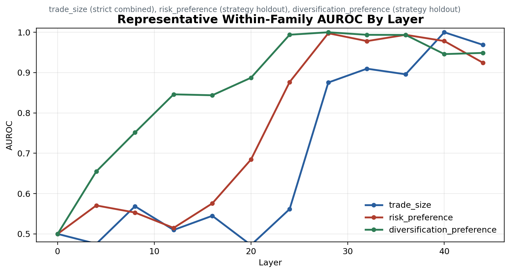
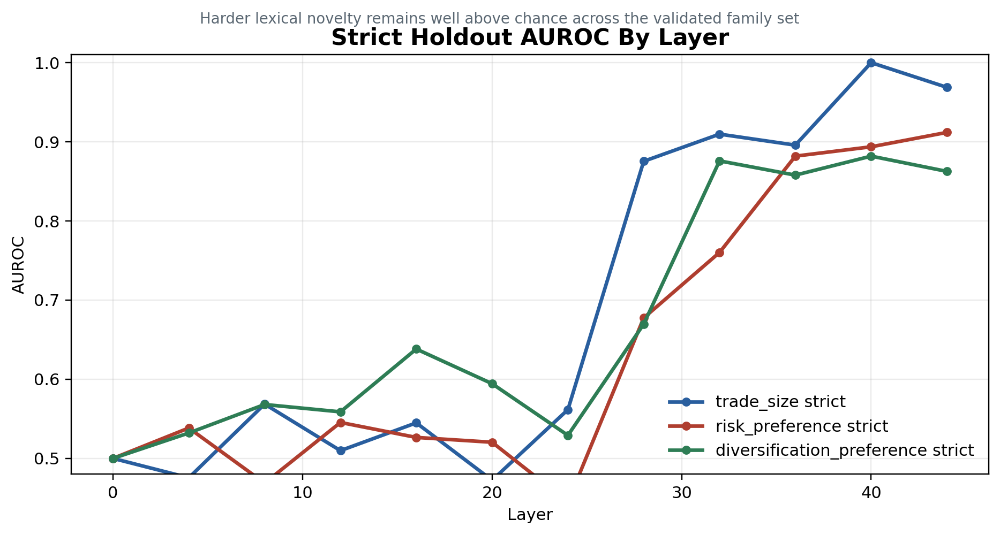
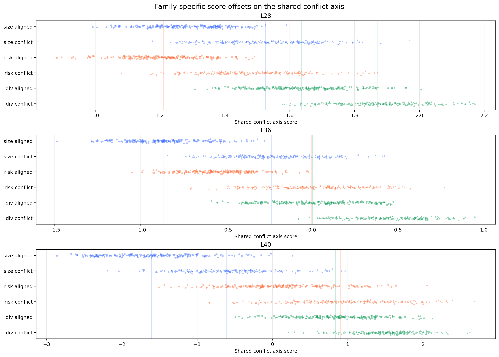
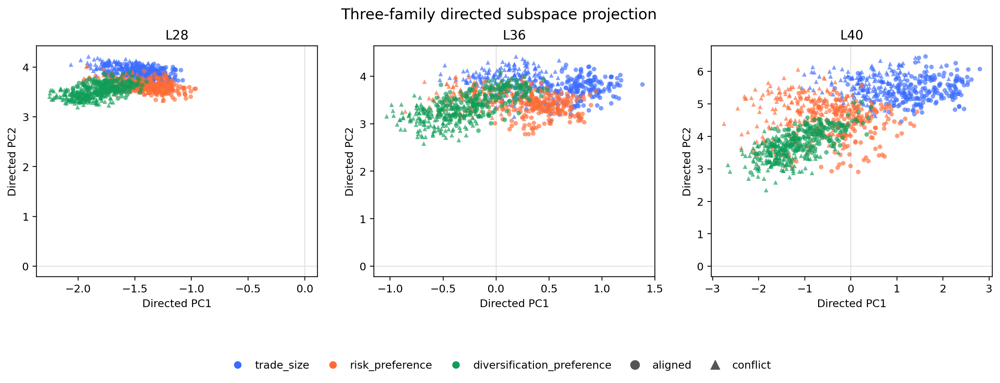

# Policy Conflict Internals in Real Agentic Contexts

## Opener

We tested whether linear probes trained on controlled policy-conflict prompts could recover conflict-like structure in real DX Terminal prompts, with the intention to build real-time mechanistic monitors to catch conflict before misaligned action is taken.

We found a clear signal for a variety of directions that rank real prompts by concrete, current-prefix action conflict, but there is more work required to discover generic conflict geometry.

The result is an early internal handle, not yet a complete detector: three synthetic conflict families share geometry, while one family transfers cleanly enough to expose a narrower real-data concept than the original labels described.

DXRG, the team behind DX Terminal, noticed strange behaviors in their trading agents when policies collide. Users often hand their agents strategies that directly conflict with their vault settings, producing misaligned behaviors downstream.

This is early validation for a methodology to bring mech interp techniques into production environments for monitoring and deeper analysis of LLMs in financial contexts.

## Problem

The vault-configured settings in the DX Terminal experiment include:

- `Trading Activity`: how readily the agent should take action instead of observing.
- `Trade Size`: how large each trade should be.
- `Risk Preference`: whether the agent should prefer safer or more aggressive opportunities.
- `Holding Style`: how long the agent should generally expect to hold positions.
- `Diversification`: whether the agent should broaden exposure or concentrate into stronger opportunities.

When deployed, agents are prompted at regular tick intervals with updated market information, and asked to call one of three tools:

- `record_observation(content, strategy?)`: records an observation without trading. `strategy` is present when the observation is tied to a specific strategy.
- `buy_token(token, spend_pct, content, strategy?)`: buys `token` using `spend_pct` percent of available ETH, with `content` explaining the decision.
- `sell_token(token, spend_pct, content, strategy?)`: sells `spend_pct` percent of the current `token` position, with `content` explaining the decision.

Users can also chat with their agent to come up with *strategies* that provide more explicit guidance for the agent. Sometimes, the user curated strategies conflict with the initial vault settings the agent was configured with, and this can lead to strange agent behavior. For example, a user may set their initial vault to `trade_size = 1`, and then after a conversation with the agent create the strategy to "Sell all positions and go full port into X Token if momentum is strong". This would imply the agent should take action with the full portfolio, which contradicts the smaller size setting used to configure the vault. 

While there are instructions in the system prompt for how to resolve this kind of conflict ("ACTIVE SETTINGS are binding execution constraints" and "STRATEGY expresses preferences that apply only within what ACTIVE SETTINGS allow"), it can still create undesirable behavior in situations where it's not clear which path to take. 

We wanted to see if the model is aware of these conflicts when processing a prompt, and discover resolution circuitry to see how conflict is handled.

## Synthetic Abstraction

Real DX Terminal traces are too noisy to probe for a single conflict type, so we built ~1100 controlled prompts to amplify a candidate signal.

Synthetic Prompt Structure:

```text
[system]
Role: trading agent.
Priority rule: ACTIVE SETTINGS are binding execution constraints.
Strategy applies only within ACTIVE SETTINGS.
Decision order: activity -> risk/diversification posture -> size.
Output format: strict JSON only.

[user]
STRATEGY: compact user preference.
ACTIVE SETTINGS: slider-like constraints.
PORTFOLIO: controlled position state.
MARKET: controlled synthetic assets and evidence.
```

Using this structure, we developed a synthetic dataset that cleanly splits both aligned and conflicted rows across three setting types: `trade_size`, `risk_preference`, and `diversification_preference`. For example, to create a conflict row for `trade_size`, we could set the `Trade Size` slider to 5 (highest size), and then add a strategy like "Never trade more than 10% of portfolio" while keeping all other things constant. Our decision to isolate conflicts into three families came from an earlier unsupervised discovery phase that showed there might exist different conflict resolution circuits depending on the *type* of conflict in the prompt.

To avoid lexical confounds, we came up with strategy and other contextual information variation and split the data for strict holdouts to ensure there is minimal leakage between train and test sets. Concretely, `Trade Size` could appear as `Execution Size`, `Size Constraint`, or `Size Setting`; risk language moved between safer/stable and aggressive/explosive phrasing; diversification rows varied whether the portfolio context made concentration or broadening the allowed behavior. The goal was not to hide the concept from the model, but to keep the probe from winning by memorizing one exact phrase.

### Families Tested

- `trade_size`: buy small vs large; output size/action axis.
- `risk_preference`: asset selection by allowed risk posture.
- `diversification_preference`: concentration vs broadening; portfolio-conditioned.

## Synthetic Probe Results

After a few iterations on the synthetic prompt structure and confound isolation, we ran the pipeline to examine initial results. 

The standard probe columns ask whether a linear direction can recover each conflict family under the normal synthetic split. The strict holdout column asks whether that signal survives when surface wording changes. The AUROC figures below show the expected shape: weak early-layer signal, stronger mid-to-late-layer separation, and lower but persistent strict-holdout performance.

### Synthetic Probe Table

| Family | Standard probe results | Strict holdout |
| --- | --- | --- |
| trade_size | XOR 0.9948 / 1.0000; strategy 1.0000 / 1.0000; settings 0.9948 / 1.0000 | 0.990 / 1.000 at L40 |
| risk_preference | XOR 0.9635 / 0.9766; strategy 0.9844 / 0.9937; settings 0.9740 / 0.9839 | 0.8854 / 0.9119 |
| diversification_preference | behavior aligned 1.0000, conflict 0.8542; XOR 0.9896 / 0.9995; strategy 1.0000 / 1.0000; settings 0.9792 / 0.9957 | 0.8333 / 0.8819 |

### Figures




## Synthetic Results Takeaway

While the three families were all readable, the cosine and PCA views show related conflict geometry with family-specific structure.

Cosines in the roughly 0.45-0.65 range are meaningfully positive, but far from collinear: `1.0` would mean the same direction, while `0.0` would mean no linear alignment. A useful real-data probe probably needs to respect both facts: conflict has shared structure, and the model may represent different conflicts in distinct subspaces.

### L36 Same-Capture Geometry

| Pair | Cosine |
| --- | --- |
| risk_preference vs trade_size | 0.6449 |
| diversification_preference vs risk_preference | 0.4684 |
| diversification_preference vs trade_size | 0.4883 |

### Geometry Figures




## First Real Transfer Attempt

The first direct transfer pass projected synthetic conflict directions onto full production prompts at coarse global sites. It did not cleanly separate complaint rows from baseline controls.

Two failures were mixed together. First, the real complaint labels correlated with policy conflict but did not consistently mark the exact prompt shape the probes were trained to read. Second, production traces include current settings, strategy text, market context, prior decisions, and complaints about behavior whose cause may have appeared earlier in the trajectory. A row can be associated with a policy failure without containing the conflict in the immediate prompt prefix.

## Bridge Program

We then used bridge datasets to separate template mismatch from content and ontology mismatch. The bridge evidence was better, but still weak: buy-only filtering helped, but the deeper issue was an unresolved ontology and representation mismatch.

The bridge splits involved stages from synthetic prompt structure toward production-like examples. If template mismatch were the only issue, we would expect the signal to recover cleanly as the format got closer. Instead, the rows that survived stricter adapters got smaller and more specific, which pushed us toward a narrower interpretation: the directions were reading a more exact conflict shape than our first real-data labels described.

The 768 -> 258 -> 118 -> 33 progression is the clue: tightening the bridge did not simply weaken the signal; it concentrated the dataset around a smaller visible-conflict ontology.

### Bridge Dataset Counts

| Dataset | Rows | Aligned | Conflict |
| --- | --- | --- | --- |
| Stage 1a template control | 768 | 384 | 384 |
| Stage 1b loose adapter | 258 | 168 | 90 |
| Stage 1b strict adapter | 118 | 81 | 37 |
| Stage 1b strict buy-only | 33 | 27 | 6 |

## Direct Projection on Real Prompts

This led to a simpler question: if we do not train a classifier and do not set thresholds, do fixed synthetic directions produce scalar structure anywhere on real DX Terminal prompts?

We swept fixed synthetic directions over real prompt sites and found the cleanest structure at L32 `settings_end`, matching the strongest layers we found from the initial probes on synthetic data. Deliberate anchor rows projected highest, controls projected lowest, and complaint rows landed in between. This tells us the synthetic direction is picking up some real current-prefix structure, but highlights how precise probes often read narrower signal than the labels train them to detect.

Here, anchors are deliberately constructed real-format examples with visible policy conflict; complaints are real user complaint rows; controls are structure-matched rows without the target conflict.

### L32 Settings-End Cohort Means

| Direction | Anchor | Complaint | Control | Anchor-control | Complaint-control |
| --- | --- | --- | --- | --- | --- |
| trade_size | 4.425 | 3.803 | 3.278 | +1.147 | +0.526 |
| shared_mean | 3.462 | 3.137 | 2.760 | +0.703 | +0.377 |

## Row Reading / Ontology Correction

We found a deeper description of our findings by examining the validation data in more detail. The preregistered root-cause proxy was wrong for the `trade_size` target. Root-cause labels diagnose why a complaint happened; the probe target is visible current-prefix conflict shape.

The row audit made the signal far clearer. High `trade_size` conflict projections were enriched for prompts where the active prompt contained a concrete action or size conflict: unwanted buys, unwanted sells, or wrong-size behavior. Low rows more often looked like strategy-ignored cases, where something went wrong behaviorally but the prompt did not present the same current sized-action collision.

Cleanly stated: `trade_size` is selective for concrete sized-action conflict in the current prefix, not generic policy conflict.

### Top/Bottom Shape Audit

| Direction | Top action/size | Top strategy ignored | Bottom action/size | Bottom strategy ignored |
| --- | --- | --- | --- | --- |
| trade_size | 20/25 | 5/25 | 15/25 | 10/25 |
| shared_mean | 20/25 | 5/25 | 9/25 | 16/25 |

### Top trade_size Complaint Types

| Type | Count |
| --- | --- |
| UNWANTED_BUY | 10/25 |
| UNWANTED_SELL | 6/25 |
| WRONG_SIZE | 4/25 |
| Concrete action/size combined | 20/25 |

## Claim Boundary

What we can say: a synthetic `trade_size` direction recovers a strong production signal at L32 `settings_end`, selective for current-prefix concrete sized-action conflict.

`shared_mean` remains exploratory. It may track broader policy tension, but the shared-family interpretation still needs more audit.

We're left with a measurable internal handle for further audit, and the understanding that probe targets and label proxies can describe different things.

## Closing / Next Steps

The specific lesson is that the probe read a narrower concept than the label. Complaint labels pointed at a real failure mode, but the transferable direction tracked visible sized-action conflict in the current prompt.

The path from interpretability experiment to product value is obviously not an easy jump from synthetic AUROC to deployment. We're discovering a clean iteration loop internally: note behavioral failures to design clean questions, test to find candidate internal signals in synthetic prompts, bring those signals back to production data, and then let the misses sharpen the picture.

For this project, the next work is to audit the `shared_mean` direction more carefully, build real-data labels around current-prefix conflict rather than broad complaint root cause, and test whether prompt or UX changes reduce the ambiguous policy-collision cases that made this problem visible in the first place.
