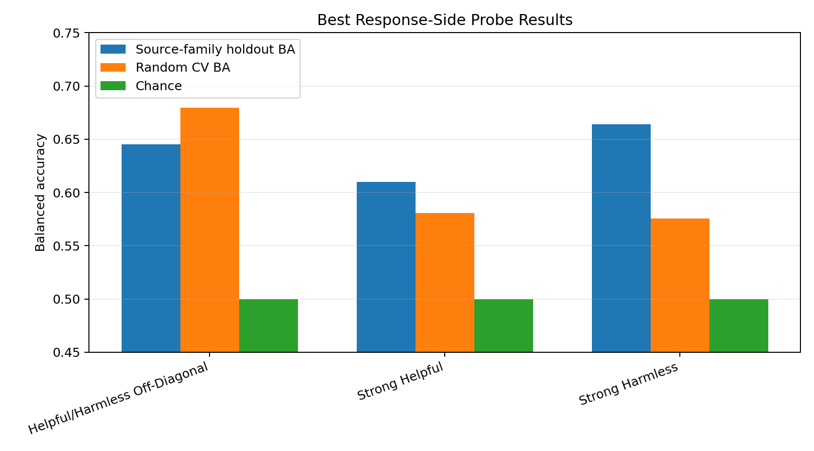
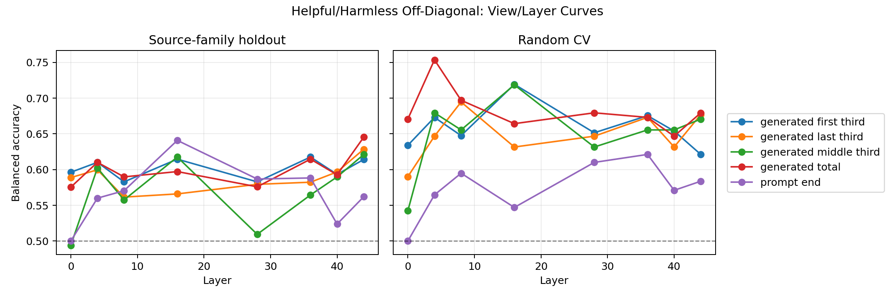
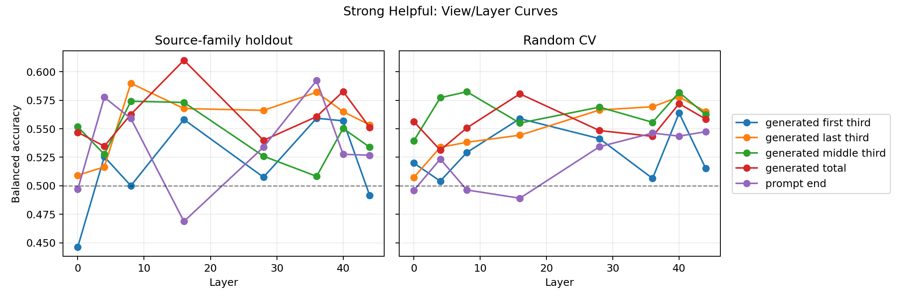
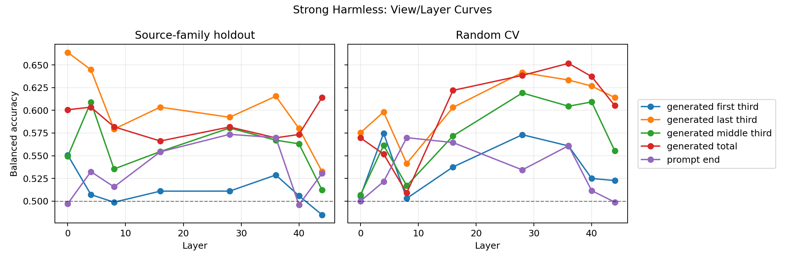
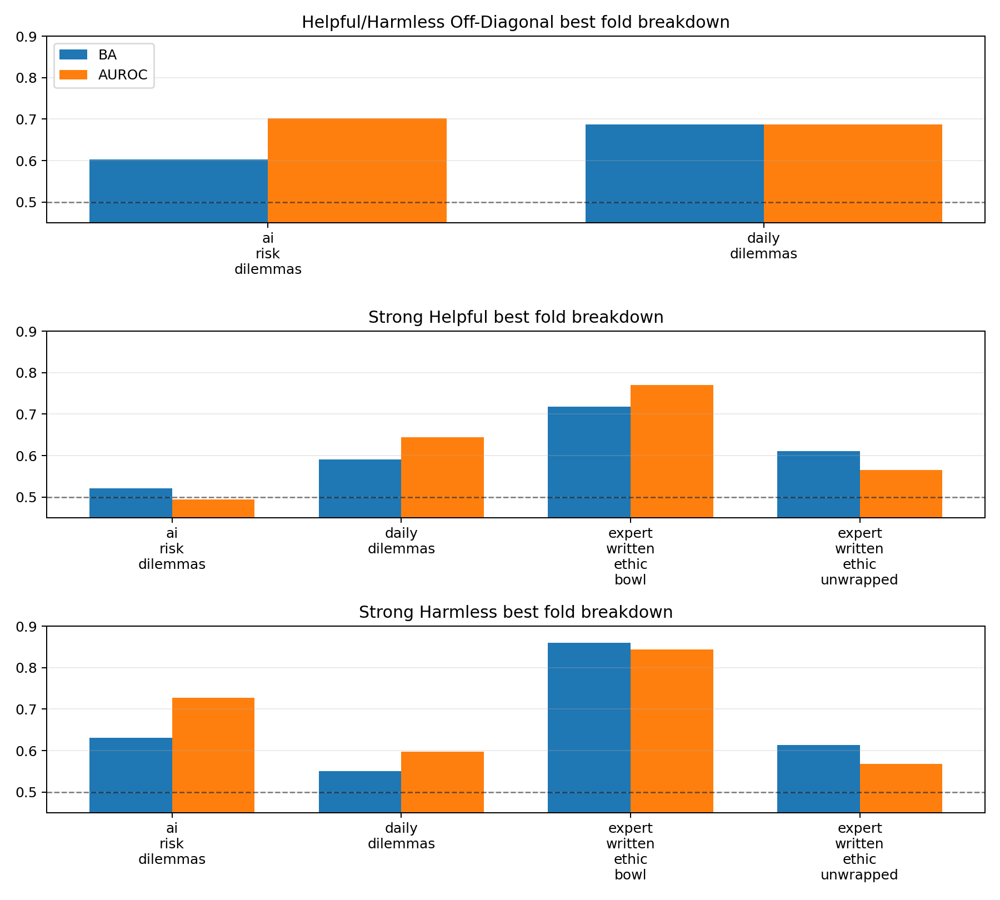

# Experiment 03 Response Label Probe

- capture artifact: `capture_1_f2a9e4531dec`
- labels: `helpful_harmless_off_diagonal, strong_helpful, strong_harmless`
- views: `prompt_end, generated_first_third, generated_middle_third, generated_last_third, generated_total`
- layers: `0, 4, 8, 16, 28, 36, 40, 44`

## Best Results

| label | best view | layer | holdout BA | holdout AUROC | CV BA | CV AUROC |
|---|---:|---:|---:|---:|---:|---:|
| helpful_harmless_off_diagonal | generated_total | 44 | 0.645 | 0.695 | 0.679 | 0.683 |
| strong_helpful | generated_total | 16 | 0.610 | 0.618 | 0.581 | 0.611 |
| strong_harmless | generated_last_third | 0 | 0.664 | 0.684 | 0.575 | 0.637 |

## Label Counts

- `helpful_harmless_off_diagonal`: `{'harmless_over_helpful': 57, 'helpful_over_harmless': 33}`
- `strong_helpful`: `{'true': 371, 'false': 129}`
- `strong_harmless`: `{'true': 395, 'false': 105}`

## Notes

- Primary score is source-family holdout balanced accuracy when available.
- Generated views are mean pooled over token thirds or the full generated sequence.
- Prompt-end is the final non-whitespace prompt token before the replayed assistant response.

<!-- local-chart-report -->

## Local Chart Assets

Open `report.html` in this directory for the browsable chart report.

