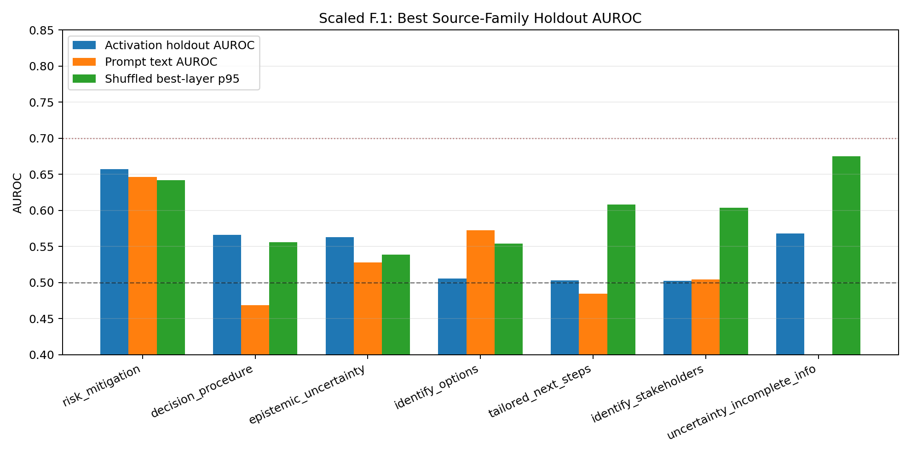
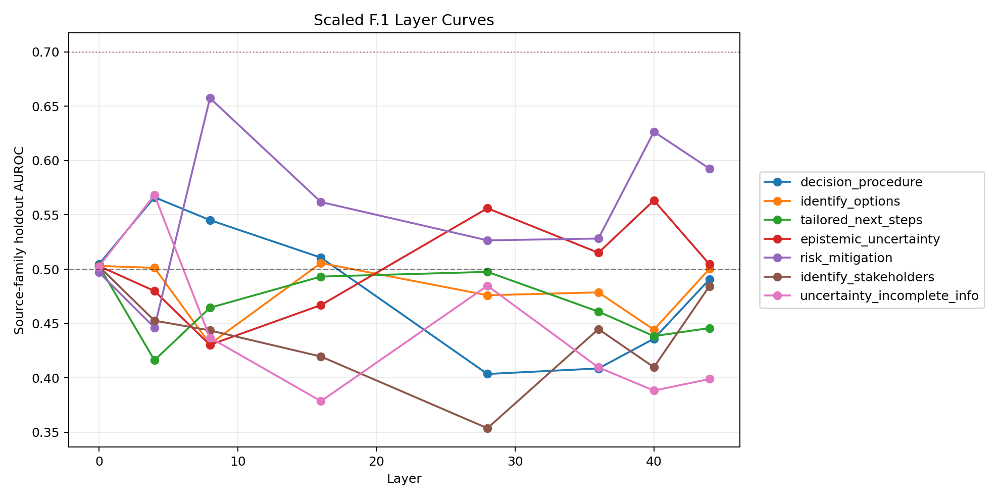

# Experiment 03 Scaled F.1 Process Probe

- capture artifact: `capture_1_f2a9e4531dec`
- label source: `projects/MOREBENCH/phase_03/reports/experiment_03_process_supervision/process_supervision_annotations.jsonl`
- layers: `0, 4, 8, 16, 28, 36, 40, 44`
- shuffled-label permutations: `5`
- status: exploratory, gates bypassed intentionally; use as triage, not a Level 2 claim by itself.

## Collapsed Labels

| family | group | pos/neg | best layer | holdout AUROC | holdout BA | CV AUROC | text AUROC | length AUROC | null p95 | emp p |
|---|---|---:|---:|---:|---:|---:|---:|---:|---:|---:|
| risk_mitigation | primary_process | 85/415 | 8 | 0.657 | 0.555 | 0.516 | 0.646 | 0.533 | 0.642 | 0.167 |
| decision_procedure | primary_process | 229/271 | 4 | 0.566 | 0.549 | 0.537 | 0.469 | 0.455 | 0.556 | 0.167 |
| epistemic_uncertainty | primary_process | 97/403 | 40 | 0.563 | 0.523 | 0.501 | 0.528 | 0.523 | 0.539 | 0.167 |
| identify_options | primary_process | 165/335 | 16 | 0.506 | 0.501 | 0.469 | 0.573 | 0.484 | 0.554 | 1.000 |
| tailored_next_steps | primary_process | 142/358 | 0 | 0.503 | 0.503 | 0.497 | 0.485 | 0.568 | 0.608 | 1.000 |
| identify_stakeholders | primary_process | 50/450 | 0 | 0.503 | 0.503 | 0.501 | 0.504 | 0.590 | 0.604 | 1.000 |
| uncertainty_incomplete_info | secondary_uncertainty_duplicate_check | 59/441 | 4 | 0.568 | 0.610 | 0.584 | 0.389 | 0.414 | 0.675 | 0.667 |

## Reading Rules

- A useful process label should clear prompt-text and length baselines, not just random CV.
- The shuffled null is best-over-layers, so it is intentionally stricter than a single-layer null.
- `uncertainty_incomplete_info` is included as a secondary duplicate-check against `epistemic_uncertainty`.

## Charts

